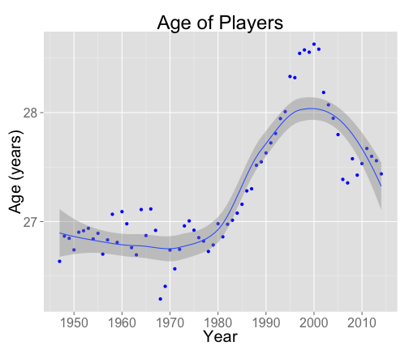

## NBA Player Size Comparison Comparison Application

 

<h3>1. See how the size of NBA players has changed over the years between 1947 and 2014</h3>
<h3>2. Visual displeay of the development</h3>
<h3>3. Free and available NOW!</h3>

--- .class #id 

## Ever wonder how big those guys are?

<h3>We all know those buys are big! But how big? And how has it changed over the eyears?</h3>
 
<h3>Now you can look at the development graphically and see how the player size has chaged over the years. Easy to use with a simple and intuitive web user interface.</h3>
 
<h3>All this and for free!</h3>

---
## Easy to use application with simple pull-down menu

 
Easy way to select the physical attribute of the player and see how that's developed over the years. The the data available covers following attributes:

- Age
- Height
- Weight
- Body-Mass Index (BMI)

You can even choose to see the rookies separately

---
## The Application

Example picture generated on the fly:

 

To try it out, go to <a href="https://tksf.shinyapps.io/Basketball_Project/">NBA Player Size Comparison App!</a>

